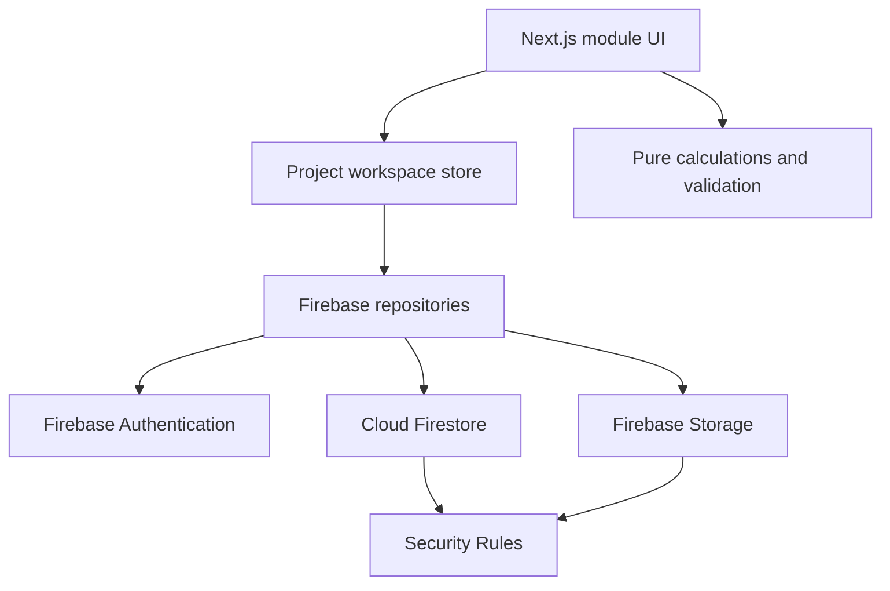

# Architecture

## Design objective

PTracker is deliberately modular. Page routes compose domain modules; modules
call reusable calculations, a shared project store and Firebase repositories.
Page components do not contain Firebase query details.

## Application layers

| Layer | Responsibility |
|---|---|
| `src/app` | App Router routes, layouts and project route boundaries |
| `src/modules` | Dashboard, Forecast, Actuals, Invoices, POAP, Reports and Admin |
| `src/components` | Shared shell, authentication and UI primitives |
| `src/state` | Immediate project workspace state and demo workspace |
| `src/firebase` | Firebase initialisation, authentication, persistence and storage |
| `src/schemas` | Zod schemas for trusted boundaries |
| `src/utils` | Pure calculations, date rules, imports, permissions and CPM |
| `firebase` | Firestore rules, Storage rules and indexes |
| `src/test` | Unit and emulator security tests |

## Deployment decision

PTracker uses Firebase App Hosting as a managed Node.js deployment. This retains
dynamic routes such as `/projects/[projectId]/dashboard`, uses the supported
Next.js adapter and permits future server-side routes without a migration.

The app is not configured as a static export. Firebase Hosting static export
would be appropriate only if all server-capable Next.js features and unknown
dynamic routes were intentionally removed.

## State and persistence

Module changes update the local project workspace immediately and then persist
the affected documents. Important multi-document operations use batches:

- forecast baseline plus activation setting
- invoice plus covered actual-entry locks
- invoice deletion plus lock release
- project backup restore

The demonstration workspace persists to browser local storage. It is for product
evaluation only and is never a substitute for Firebase production data.

## Date policy

Project dates are plain `yyyy-MM-dd` calendar dates. They are parsed at local
midday and are never converted through UTC. Project Start Date must be a Monday.
Week calculations use calendar-day difference from that Monday.

## Key assumptions

- Currency is AUD.
- ANZ FI hours use 8 hours per day; IND uses 9.
- Working days are Monday to Friday.
- Configured project holidays are stored and exposed for scheduling extensions.
- Customer viewers receive delivery-safe outputs and cannot read rate/cost
  collections.
- Forecast replacements create new approved baseline documents. Approved
  baseline documents are not updated or deleted.
- POAP automatic progress assumes planned work through Today has occurred unless
  an activity explicitly enables manual progress.

